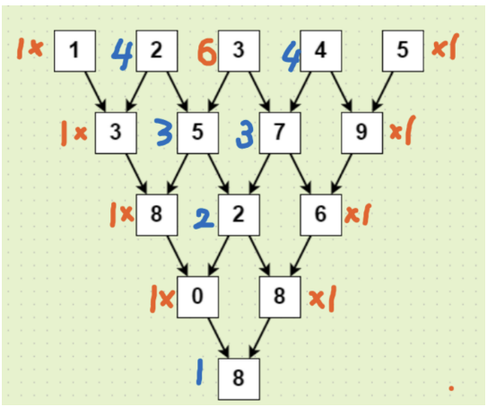

# 🔥 Leetcode Problem (2221)

> **Problem:** [Find Triangular Sum of an Array](https://leetcode.com/problems/find-triangular-sum-of-an-array/) 
> **Difficulty:** Medium 
> **Tags:** `Array`, `Math`, `Simulation`, `Combinatorics`

---

### ✅ Intuition

For this problem, there are 2 approaches to solve it:

#### O(n^2) approach - simplest

Just simulate the problem as described by the challenge. You will iteratively generate new array of numbers by adding 2 consecutive numbers in the original array. Repeat this step until there is only 1 element left.

#### O(n) approach - Newton's binomial theorem

You can then easily come up with this formula 

$ans= ∑_{i=0}^{n−1} C_i^{n−1}nums[i](mod10)$
